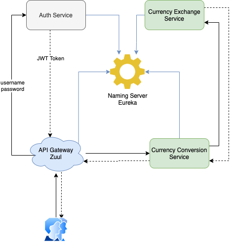
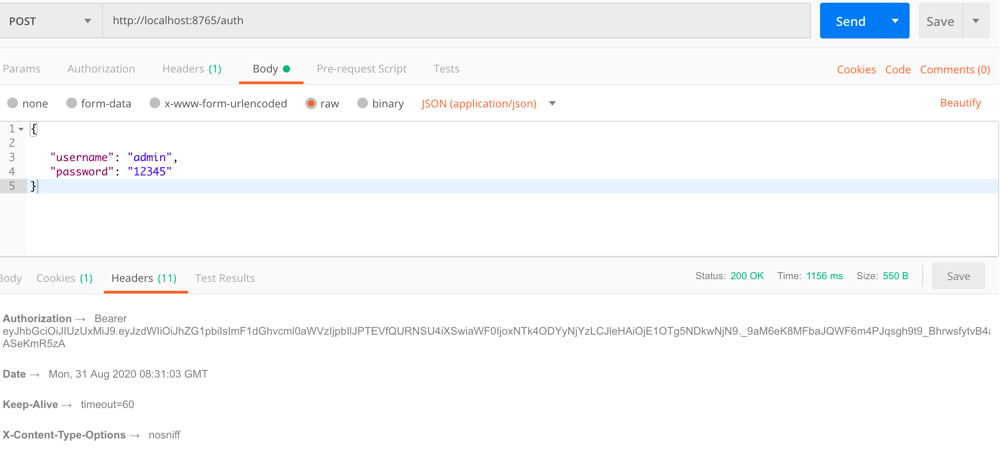
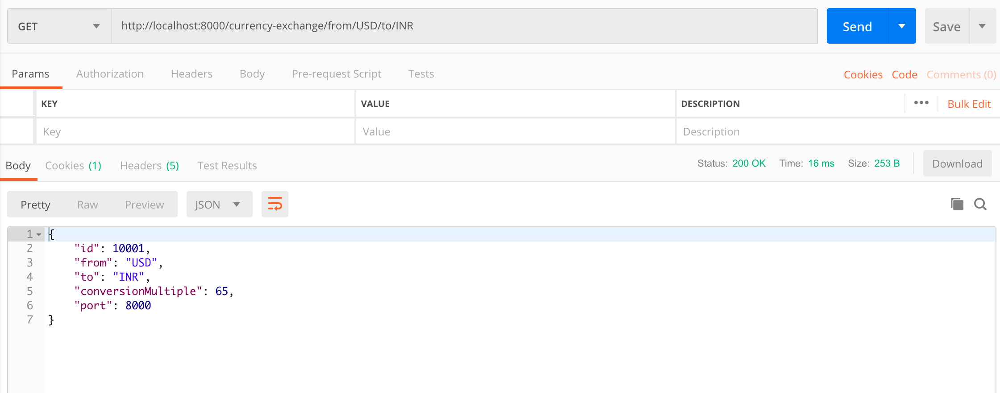
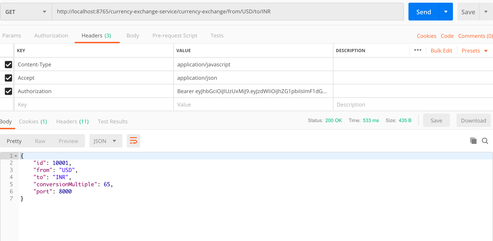
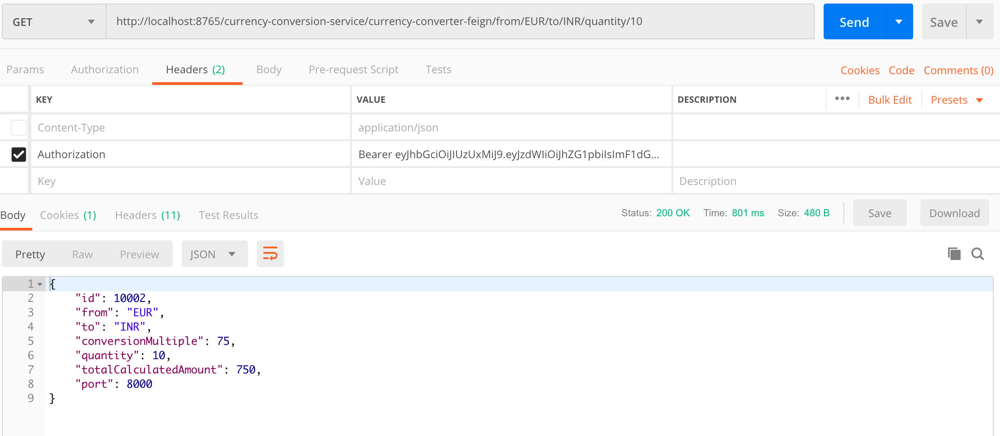

### Microservices with Spring Boot

**I. Architecture Design.**
  
  
  
**II. Services**

1. Naming Server - This is a Eureka Service
2. Api Gateway -  This is a Zuul Service
3. Auth Service - This is a Spring Boot Web service
4. Currency Exchange Service - This is a Spring Boot Web service
5. Currency Conversion Service  - This is a Spring Boot Web service

**III. How to run**

Run the Naming Server, Api Gateway, Auth Service, Currency Exchange, Currency Conversion Service in order. 

- Naming Server [http://localhost:8761/](http://localhost:8761/)
- Api Gateway: [http://localhost:8765/](http://localhost:8765/)
- Auth Service: [http://localhost:9100/](http://localhost:9100/)
- Currency Exchange Service: [http://localhost:8000/](http://localhost:8000/)
- Currecy Conversion Service: [http://localhost:8100/](http://localhost:8100/)

**Run Auth Service to get th JWT token**

**Run Currency Exchange Service Standalone**

**Run Currency Exchange via Api Gateway using JWT token from Auth Service**

**Run Currency Conversion Service via API Gateway using JWT token from Auth Service**
